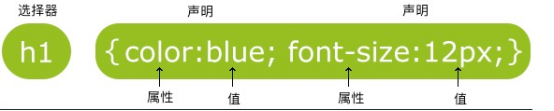
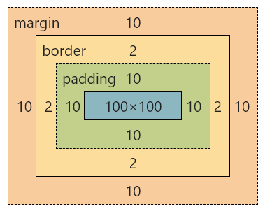

# CSS3

## CSS简介


### CSS概念

CSS（Cascading Style Sheets）层叠样式表，又叫级联样式表，简称样式表

CSS文件后缀名为`.css`

CSS用于HTML文档中元素样式的定义


### 为什么需要CSS

使用css的唯一目的就是让网页具有美观一致的页面


### 语法

CSS 规则由两个主要的部分构成：选择器，以及一条或多条声明（样式）



选择器通常是您需要改变样式的 HTML 元素

每条声明由一个属性和一个值组成

属性（property）是您希望设置的样式属性（style attribute）。每个属性有一个值。属性和值被冒号分开

```css
<style>
    h1{
        color: blue;
        font-size: 12px;
    }
</style>
```


## CSS的引入方式


### 内联样式（行内样式）

要使用内联样式，你需要在相关的标签内使用样式（style）属性。Style 属性可以包含任何 CSS 属性

> **温馨提示**
>
> 缺乏整体性和规划性，不利于维护，维护成本高

```html
<p style="background: orange; font-size: 24px;">CSS<p>
```


### 内部样式

当单个文档需要特殊的样式时，就应该使用内部样式表。你可以使用 `<style>` 标签在文档头部定义内部样式表

> **温馨提示**
>
> 单个页面内的CSS代码具有统一性和规划性，便于维护，但是在多个页面之间容易混乱

```html
<head>
    <style> 
       h1 { 
           background: red; 
       } 
    </style>
</head>
```


### 外部样式（推荐）

当样式需要应用于很多页面时，外部样式表将是理想的选择。在使用外部样式表的情况下，你可以通过改变一个文件来改变整个站点的外观。每个页面使用 `<link>` 标签链接到样式表。 `<link>` 标签在（文档的）头部

```html
<link rel="stylesheet" type="text/css" href="xxx.css">
```


## 选择器一

CSS语法 规则由两个主要的部分构成：**选择器**，以及一条或多条声明（样式）


### 全局选择器

可以与任何元素匹配，优先级最低，一般做样式初始化

```css
*{
     margin: 0;
     padding: 0;
 }
```


### 元素选择器

HTML文档中的元素，`p、b、div、a、img、body`等。

标签选择器，选择的是页面上所有这种类型的标签，所以经常描述“共性”，无法描述某一个元素的“个性”

```css
p{
    font-size:14px;
}
```

再比如说，我想让“学完前端，继续学Java”这句话中的“前端”两个变为红色字体，那么我可以用`<span>`标签把“前端”这两个字围起来，然后给`<span>`标签加一个标签选择器

```html
<p>学完了<span>前端</span>，继续学Java</p>
span{
	color: red;
}
```

> **温馨提示**
>
> 1. 所有的标签，都可以是选择器。比如ul、li、label、dt、dl、input、div等
> 2. 无论这个标签藏的多深，一定能够被选择上
> 3. 选择的所有，而不是一个


### 类选择器

规定用圆点 `.` 来定义，针对你想要的所有标签使用

> **优点**
>
> 灵活

```html
<h2 class="oneclass">你好</h2>
/*定义类选择器*/
.oneclass{
	width:800px;
}
```

> **class属性的特点**
>
> 1. 类选择器可以被多种标签使用
> 2. 类名不能以数字开头
> 3. 同一个标签可以使用多个类选择器。用空格隔开

```html
<h3 class="classone  classtwo">我是一个h3啊</h3>
```

```html
<h3 class="teshu" class="zhongyao">我是一个h3啊</h3>  // 错误
```


## 选择器二


### ID选择器

针对某一个特定的标签来使用，只能使用一次。`css`中的`ID选择器`以 `#` 来定义

```html
<h2 id="mytitle">你好</h2>
#mytitle{
    border:3px dashed green;
}
```

> **特别强调**
>
> 1. ID是唯一的
> 2. ID不能以数字开头


### 合并选择器

语法：`选择器1,选择器2,...{ }`

作用：提取共同的样式，减少重复代码

```css
.header, .footer{
    height:300px;
}
```


### 选择器的优先级

CSS中,权重用数字衡量

元素选择器的权重为: 1

class选择器的权重为: 10

id选择器的权重为: 100

内联样式的权重为: 1000

优先级从高到低: 行内样式 > ID选择器 > 类选择器 > 元素选择器


## 字体属性

CSS字体属性定义字体，颜色、大小，加粗，文字样式


### color

规定文本的颜色

```css
div{ color:red;}
div{ color:#ff0000;}
div{ color:rgb(255,0,0);}
div{ color:rgba(255,0,0,.5);}
```


### font-size

设置文本的大小

能否管理文字的大小，在网页设计中是非常重要的。但是，你不能通过调整字体大小使段落看上去像标题，或者使标题看上去像段落。

```css
h1 {font-size:40px;}
h2 {font-size:30px;}
p {font-size:14px;}
```

> **温馨提示**
>
> chrome浏览器接受最小字体是12px


### font-weight

设置文本的粗细

| 值      | 描述                                       |
| ------- | ------------------------------------------ |
| bold    | 定义粗体字符                               |
| bolder  | 定义更粗的字符                             |
| lighter | 定义更细的字符                             |
| 100~900 | 定义由细到粗  400等同默认，而700等同于bold |

```css
H1 {font-weight:normal;}
div{font-weight:bold;}
p{font-weight:900;}
```


### font-style

指定文本的字体样式

| 值     | 描述       |
| ------ | ---------- |
| normal | 默认值     |
| italic | 定义斜体字 |


### font-family

font-family属性指定一个元素的字体

> **温馨提示**
>
> 每个值用逗号分开
>
> 如果字体名称包含空格，它必须加上引号

```css
font-family:"Microsoft YaHei","Simsun","SimHei";
```


## 背景属性

CSS背景属性主要有以下几个

| 属性                | 描述                 |
| ------------------- | -------------------- |
| background-color    | 设置背景颜色         |
| background-image    | 设置背景图片         |
| background-position | 设置背景图片显示位置 |
| background-repeat   | 设置背景图片如何填充 |
| background-size     | 设置背景图片大小属性 |


### background-color属性

该属性设置背景颜色

```css
<div class="box"></div>
.box{
    width: 300px;
    height: 300px;
    background-color: palevioletred;
}
```


### background-image属性

设置元素的背景图像

元素的背景是元素的总大小，包括填充和边界（不包括外边距）。默认情况下background-image属性放置在元素的左上角，如果图像不够大的话会在垂直和水平方向平铺图像，如果图像大小超过元素大小从图像的左上角显示元素大小的那部分

```css
<div class="box"></div>
.box{
    width: 600px;
    height: 600px;
    background-image: url("images/img1.jpg");
}
```


### background-repeat属性

该属性设置如何平铺背景图像

| 值        | 说明             |
| --------- | ---------------- |
| repeat    | 默认值           |
| repeat-x  | 只向水平方向平铺 |
| repeat-y  | 只向垂直方向平铺 |
| no-repeat | 不平铺           |

```css
.box{
    width: 600px;
    height: 600px;
    background-color: #fcc;
    background-image: url("images/img1.jpg");
    background-repeat: no-repeat;
}
```


### background-size属性

该属性设置背景图像的大小

| 值         | 说明                                                         |
| ---------- | ------------------------------------------------------------ |
| length     | 设置背景图片的宽度和高度，第一个值宽度，第二个值高度，如果只是设置一个，第二个值auto |
| percentage | 计算相对位置区域的百分比，第一个值宽度，第二个值高度，如果只是设置一个，第二个值auto |
| cover      | 保持图片纵横比并将图片缩放成完全覆盖背景区域的最小大小       |
| contain    | 保持图片纵横比并将图像缩放成适合背景定位区域的最大大小       |

```css
.box{
    width: 600px;
    height: 600px;
    background-image: url("images/img1.jpg");
    background-repeat: no-repeat;
    background-size: 100% 100%;
}
```


### background-position属性

该属性设置背景图像的起始位置，其默认值是：0% 0%

| 值            | 说明                                                         |
| ------------- | ------------------------------------------------------------ |
| left  top     | 左上角                                                       |
| left center   | 左 中                                                        |
| left bottom   | 左 下                                                        |
| right top     | 右上角                                                       |
| right center  | 右 中                                                        |
| right bottom  | 右 下                                                        |
| center top    | 中 上                                                        |
| center center | 中 中                                                        |
| center bottom | 中 下                                                        |
| x%  y%        | 第一个值是水平位置，第二个值是垂直位置，左上角是0%  0%，右下角是100%  100% 。如果只指定了一个值，其他值默认是50%。默认是0%  0% |
| xpos ypos     | 单位是像素                                                   |

```css
.box{
    width: 600px;
    height: 600px;
    background-color: #fcc;
    background-image: url("images/img1.jpg");
    background-repeat: no-repeat;
    background-position: center;
}
```


## CSS 盒子模型(Box Model)


### 概念

所有HTML元素可以看作盒子，在CSS中，"box model"这一术语是用来设计和布局时使用

CSS盒模型本质上是一个盒子，封装周围的HTML元素，它包括：

外边距（margin），边框（border），内边距（padding），和实际内容（content）





1. Margin(外边距) - 清除边框外的区域，外边距是透明的（两个值：第一个值上下，第二个值左右）
2. Border(边框) - 围绕在内边距和内容外的边框
3. Padding(内边距) - 清除内容周围的区域（两个值：第一个值上下，第二个值左右）
4. Content(内容) - 盒子的内容，显示文本和图像


如果把盒子模型看作是一个生活中的快递，那么内容部分等同于你买的实物，内边距等同于快递盒子中的泡沫，边框等同于快递盒子，外边距等同于两个快递盒子之间的距离