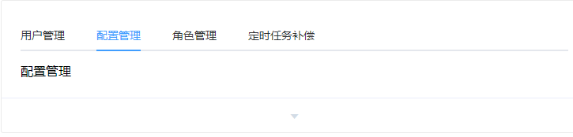

# 组件

## Tabs 标签页

分隔内容上有关联但属于不同类别的数据集合。


### 基础用法

基础的、简洁的标签页。



Tabs 组件提供了选项卡功能，默认选中第一个标签页，你也可以通过 `value` 属性来指定当前选中的标签页。

```javascript
<template>
  <el-tabs v-model="activeName" @tab-click="handleClick">
    <el-tab-pane label="用户管理" name="first">用户管理</el-tab-pane>
    <el-tab-pane label="配置管理" name="second">配置管理</el-tab-pane>
    <el-tab-pane label="角色管理" name="third">角色管理</el-tab-pane>
    <el-tab-pane label="定时任务补偿" name="fourth">定时任务补偿</el-tab-pane>
  </el-tabs>
</template>
<script>
  export default {
    data() {
      return {
        activeName: 'second'
      };
    },
    methods: {
      handleClick(tab, event) {
        console.log(tab, event);
      }
    }
  };
</script>
```

